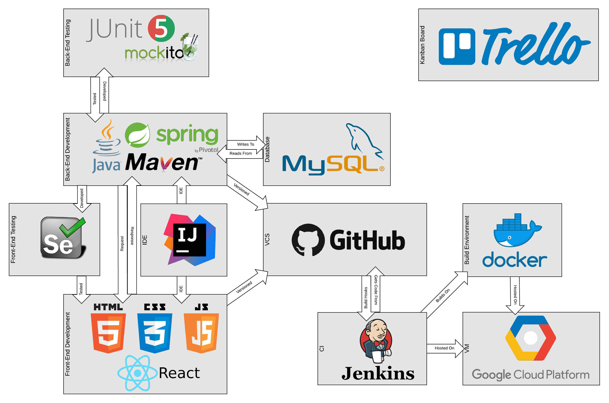
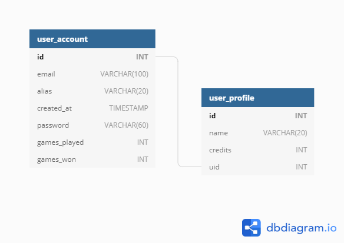
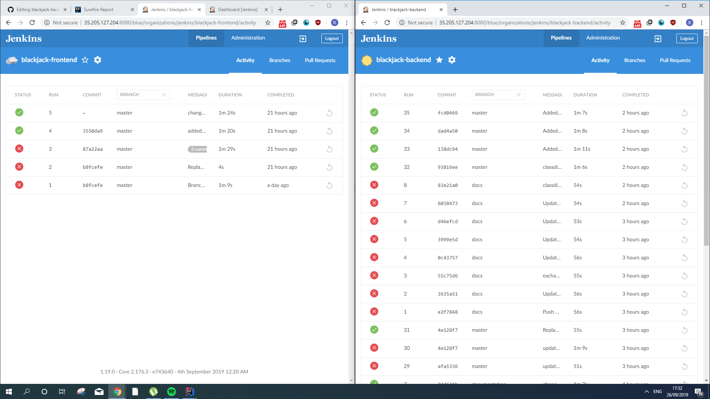
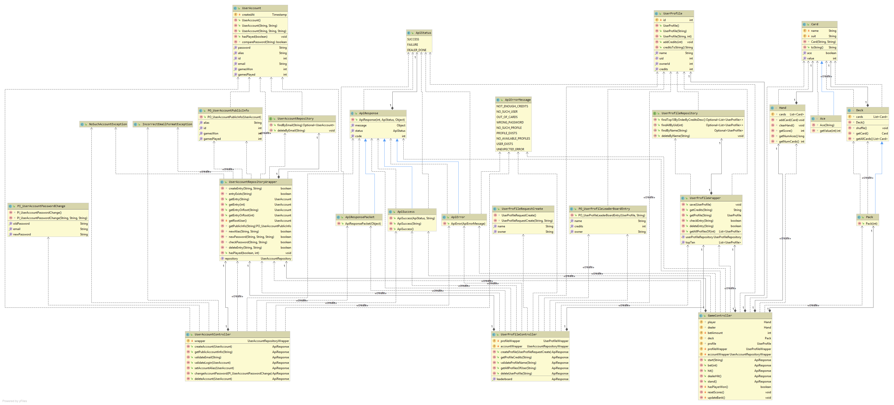
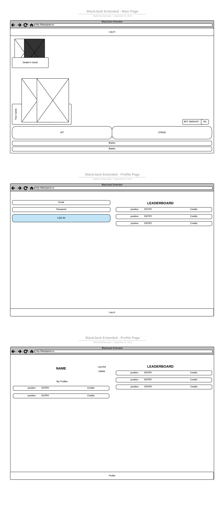

## BlackJack: An Application
This repository, along with its frontend counterpart found [here](https://github.com/Arcero1/blackjack-frontend),
is my submission for the QA Academy Individual Project.

## 1. INTRODUCTION
### 1a. The Brief
Create an OOP-based application with utilisation of supporting tools, methodologies and technologies that encapsulate all core modules covered during training.

### 1b. Motivation
The brief was to create a simple implementation of an online CRUD database. 
However, due to the open-ended nature of the project, coupled with 
the creator's distaste for data entry, a basic database was out of the question
before it was considered.
 
As throughout the first two weeks in the academy,
the creator had already created two separate "blackjack"-ish functions,
he considered himself something of an expert in blackjack.

Because of this, as well as a truly pitiful lack of online blackjack applications, 
the idea for this project was devised.

### 1c. The Solution
The main aim of the project was the creation of a full-stack implementation of an online game of blackjack.
Ultimately, such an implementation would be played just as blackjack would in a casino (save the gambling real money part).

## 2. THE PROJECT AT LARGE
### 2a. Architecture

### 2b. Database
The database used was based on MySQL and featured two tables linked using a simple one-to-many relationship. The schema is shown below.

### 2c. Continuous Integration
The continuous integration was facilitated with Jenkins.
There are two seperate pipelines - one for the front end and another for the back, both triggered by a push to their respective github repositories.

After a push, the repository is pulled down and a production build of each repository is built on the Jenkins server. The builds are then copied to two seperate containers, which are then built and spun up. The backend pipeline also includes a test step.

Notes:
* Manual hooks broke at some point. This was dealt with by adding GitHub Jenkins credentials and having jenkins manage hooks itself (it was then necessary to make Jenkins ignore branches other than *master*).
* Branch *documents* is used to update documentation without unnecessary build triggering.

## 3. BACKEND
The backend is written in Java, with Maven as a package manager. The class diagram below shows the system in it's entirety as it is at submission date:

### 3a. Container/Production Build
In production, the java is packaged into a .jar and run on an openjdk:11-slim container (newer java version than contained in the suggested openjdk:8-alpine was necessary due to Java 10 usage).

### 3b. Testing
Unit testing was completed using JUnit and Mockito. Where Spring was not involved, the code was developed in a (semi) test-driven way. As Spring was not known at the beginning of the project, it was difficult to apply the principle to development. The test and coverage results are shown below:

[coverage report](docs/reports/coverage/coverage-report.md)
([html version](docs/reports/coverage/coverage-report.html))

[surefire report](docs/reports/surefire/surefire-report.md)
([html version](docs/reports/surefire/surefire-report.html))

An up to date surefire report is composed by the Jenkins CI server every time a build runs. The most recent report is stored on the GCP build server.

The test coverage is currently at 80%, with much of the lack due to basic classes with only getters and setters that were determined to be unimportant to test. The remainder is due to difficult-to-test classes that require time that is currently not available. Tests for these classes will be devised as soon as possible.

## 4. FRONTEND
The frontend was built as a one page application (OPM) on a React framework.

### 4a. Visual Design
The product as of submission conforms quite closely to the design created at the beginning of the mockup process,
as evidenced by the wireframes below. This is because the project was largely an exercise in conforming to the design,
rather than adapting it to ability or coder preferences.

The features that differ from the preliminary designs include:
  * an expanded bet panel, due to the general emptyness of the screen when no cards are present
  * no ranks are available as of yet for profiles and leaderboard
  * the profile tab is fixed at the top, instead of being pushed to the bottom when the dashboard is open

The latter two are still planned features.

### 4b. Testing
There are currently only 2 Selenium tests covering only a very small part of the website functionality. They are the main priority, and definitely a big reason for the bugs that still exist in the webapp. The limiting factor was that Selenium tests require a large amount of infrastructure in the front-end which wasn't pre-planned and took too long to create.

## 5. CONCLUSION

### 5a. Code Quality Checking
Code quality was checked with Codacy.com. 

The back-end received a grade of **B**, and 64 issues with 1 being "error prone" and the rest being code-style issues. The full report is **[HERE](https://app.codacy.com/manual/Arcero1/blackjack-backend/dashboard?bid=14210518)**.

It should be noted here, that IntelliJ does not agree with codacy on the allowability of package-private members. Since IntelliJ gives continuous advice, I take this and ignore codacy. 

The front-end received a grade of **C**, and 559 issues with 91 being "error prone" and the rest being code-style issues. I am working on reducing this. The full report is **[HERE](https://app.codacy.com/manual/Arcero1/blackjack-frontend/dashboard?bid=14210519)**.

### 5b. Future Development
Before any other features are added, there are many necessary fixes and streamlining that is required immediatelly. This includes:
  * Finishing automated tests for the backend
  * Creating a large amount of tests for the frontend
  * Removing the bugs 
  * Streamlining the backend codebase

The first feature after this would preferably be a session system to allow more than one user to play at the same time.

Further features should not even be considered before these are completed. For an insight of the product, see the public [Trello](https://trello.com/b/x7tRWfsQ/blackjack)
